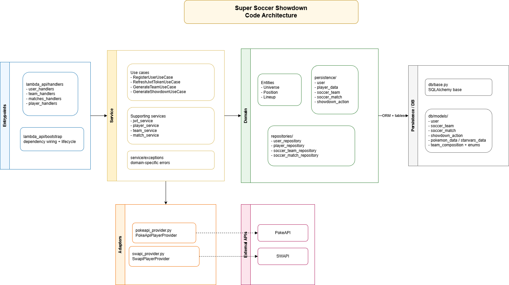
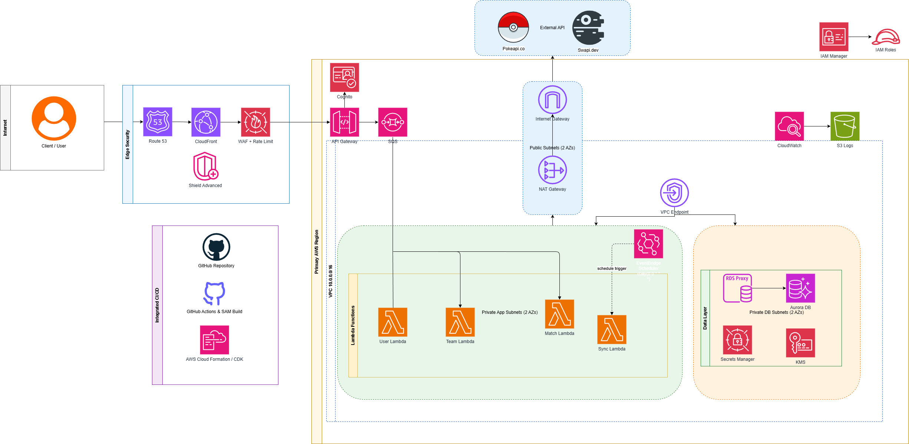
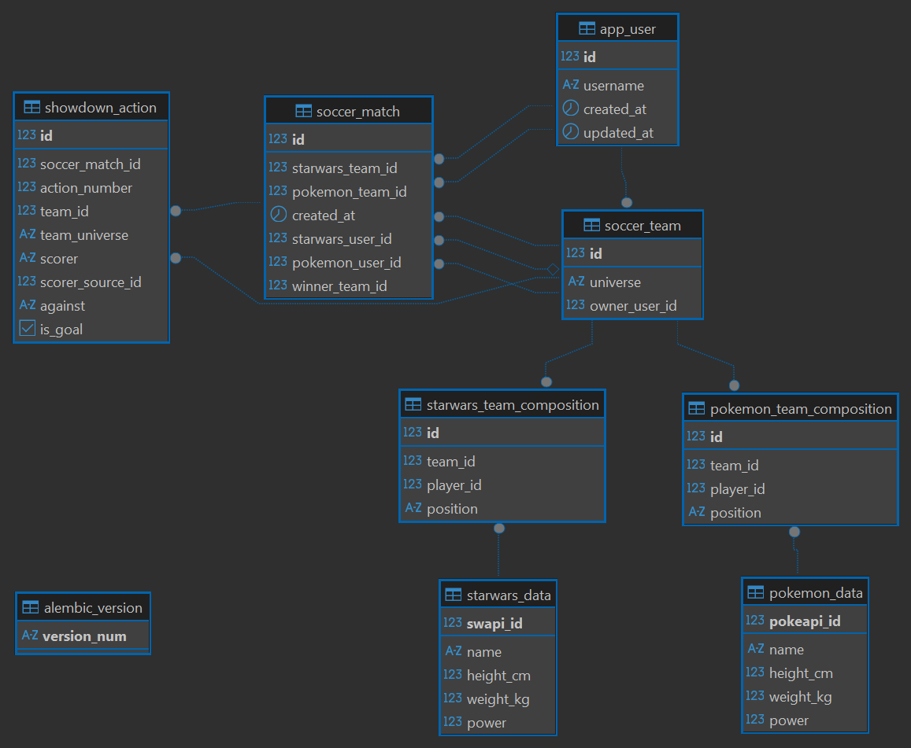

# Super Soccer Showdown

The Star Wars and Pokémon universes have collided and a big soccer tournament is being planned to settle which universe is best.

## Table of Contents

- [Solution Overview](#solution-overview)
- [Architecture](#architecture)
  - [Application Architecture](#application-architecture)
  - [AWS Deployment](#aws-deployment)
  - [Database Structure](#database-structure)
- [API Endpoints](#api-endpoints)
- [Run Locally](#run-locally-lambda--api-gateway)
- [Run Tests](#run-tests)

---

## Solution Overview

This project provides a REST API running as AWS Lambda functions (via AWS SAM) that generates random "Super Soccer Showdown" teams drawn from two universes:

- **Star Wars** players via [SWAPI](https://swapi.dev)
- **Pokémon** players via [PokeAPI](https://pokeapi.co)

### Team Rules

1. Team size is always **5 players**.
2. Each player has exactly **one position**.
3. Each player record includes:
   - `Name`
   - `Weight` (kg)
   - `Height` (cm)
   - `Power` -computed from `Weight` and `Height`
4. Positions are assigned by physical stats:
   - **Goalie** — tallest player
   - **Defence** — heaviest players
   - **Offence** — shortest players
5. Lineup composition is configurable:
   - `defenders + attackers = 4`
   - 1 goalie is always present

---

## Architecture

### Application Architecture

The backend follows a **hexagonal architecture**. All source code lives under `infrastructure/src/super_soccer_showdown/`.



| Layer | Path | Responsibility |
|---|---|---|
| `domain/` | `domain/` | Entities, persistence models, mappers, repository contracts |
| `service/` | `service/` | Business use cases and services |
| `adapters/` | `adapters/` | External API clients (SWAPI, PokeAPI) |
| `db/` | `db/` | SQLAlchemy base and ORM models |
| `entrypoints/` | `entrypoints/lambda_api/` | Lambda handlers and dependency bootstrap |

### AWS Deployment



The application deploys to AWS using:

- **API Gateway** + **AWS Lambda** (one function per route group)
- **RDS PostgreSQL** inside a **VPC** for data persistence
- **SQS** for async job queuing
- **EventBridge Scheduler** for periodic player sync
- **CloudWatch** for logs, metrics, and alarms
- **S3** for log archiving
- **GitHub Actions** for CI/CD via OIDC

### Database Structure



---

## API Endpoints

### Authentication

#### Register User

- `POST /users/register`
- **Body:**
  ```json
  { "username": "ash_ketchum" }
  ```

#### Refresh JWT Token

- `GET /users/token/refresh/{user_id}`
---

### Teams

#### List Teams (Paginated)

- `GET /teams`
- **Query params:**
  - `page` (default `1`)
  - `page_size` (default `10`, max `100`)
  - `universe` (optional: `starwars` or `pokemon`)
  - `user_id` (optional integer)

```bash
curl "http://127.0.0.1:3000/teams?page=1&page_size=10&universe=starwars&user_id=1"
```

#### Generate a Team for One Universe

- `POST /teams/{universe}`
- `universe`: `starwars` or `pokemon`
- **Query params:**
  - `defenders` (default `2`)
  - `attackers` (default `2`)

```bash
curl -X POST "http://127.0.0.1:3000/teams/starwars?defenders=3&attackers=1"
```

---

### Showdown

#### Generate Full Showdown (Both Teams)

- `POST /showdown`
- **Optional JSON body:**

```json
{
  "team_1" : 1,
  "team_2":  2
}
```

```bash
curl -X POST "http://127.0.0.1:3000/showdown" \
  -H "Content-Type: application/json" \
  -d '{"starwars":{"defenders":2,"attackers":2},"pokemon":{"defenders":1,"attackers":3}}'
```

---

### Matches

#### List Matches (Paginated)

- `GET /matches`
- **Query params:**
  - `page` (default `1`)
  - `page_size` (default `10`, max `100`)
  - `user_id` (optional integer — matches where the user appears on either side)

```bash
curl "http://127.0.0.1:3000/matches?page=1&page_size=10&user_id=1"
```

---

### Players

#### Sync Players Catalog

- `GET /players/sync`
- Fetches all players from both universes and upserts them into the database.

```bash
curl "http://127.0.0.1:3000/players/sync"
```

---

## Run Locally (Lambda + API Gateway)

**Prerequisites:**
- Python 3.12+
- [AWS SAM CLI](https://docs.aws.amazon.com/serverless-application-model/latest/developerguide/install-sam-cli.html)
- Docker (for `sam local`)

From `infrastructure/`:

```bash
pip install -r requirements.txt
sam build
sam local start-api
```

| URL | Description |
|---|---|
| `http://127.0.0.1:3000` | API base URL |
| `http://127.0.0.1:3000/docs` | Swagger UI |
| `http://127.0.0.1:3000/openapi.json` | OpenAPI 3.0 spec (JSON) |

---

## Run Tests

From `infrastructure/`:

```bash
python -m pytest tests/ -v
```
